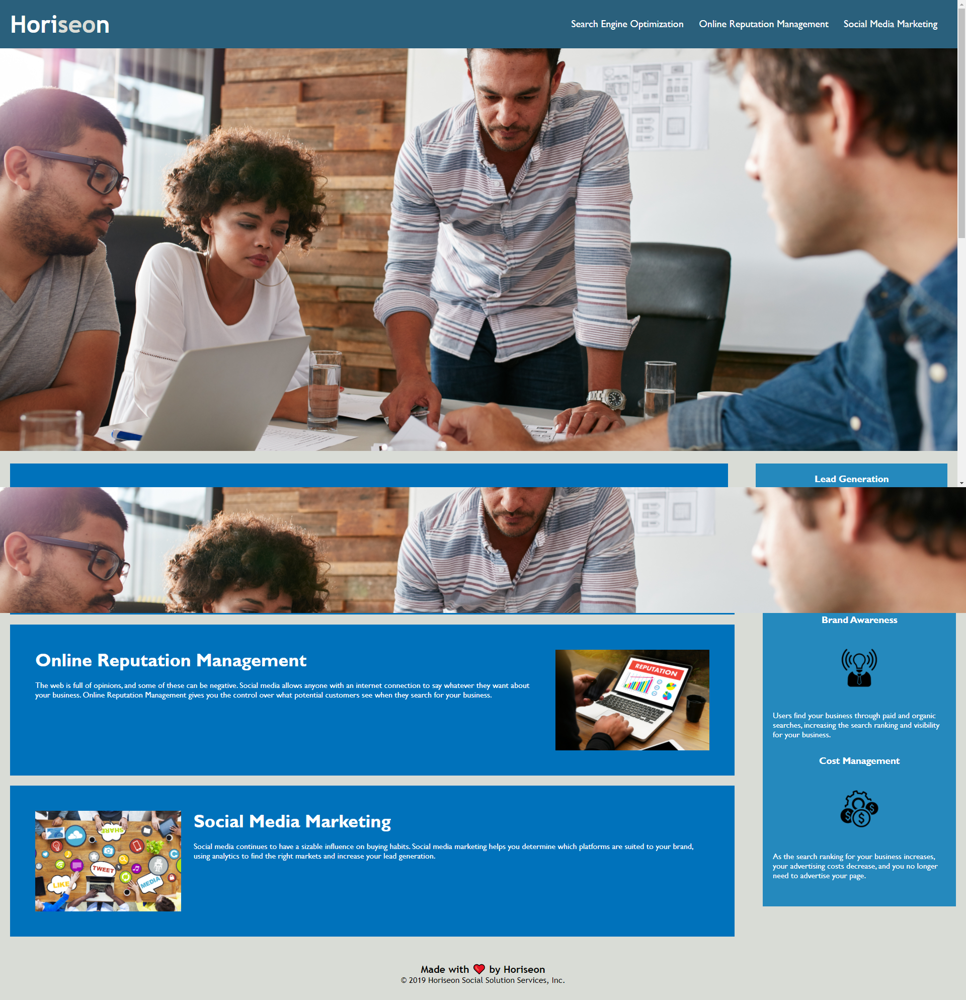

# Horiseon Project

## Project link

Click [here](TODO) to view project on GitHub pages

## Description

AS A marketing agency we were tasked to refactor the webpage by Horiseon by adding semantic HTML and making the website more accessible

## What did I do?

- Heading and Footer changed
- Replace HTML element with semantic HTML elements
- Fixed nav link bug
- Updated title of webpage for SEO
- Made images more accessible by adding alt attributes
- Formatted code using lint (prettier)

## Getting Started

- Clone the GitHub project on to your local machine
- Navigate in to the
- Open the project in VSCode
- Open the `index.html` file in ypur default browser

```
git clone git@github.com:Hakkelo89/homework-week-1.git
cd homework-week-1
code .
```

## Secreenshots

### Before Refactor



### After Refactor


